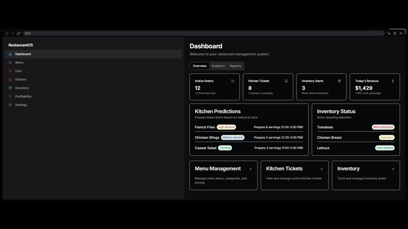
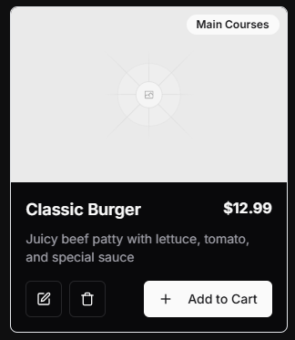
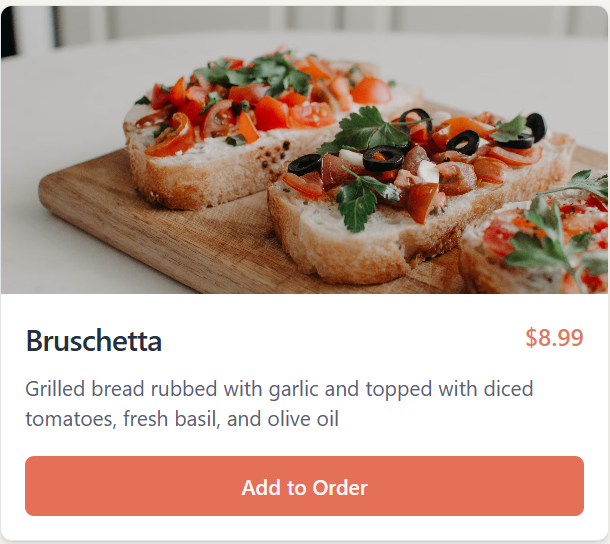
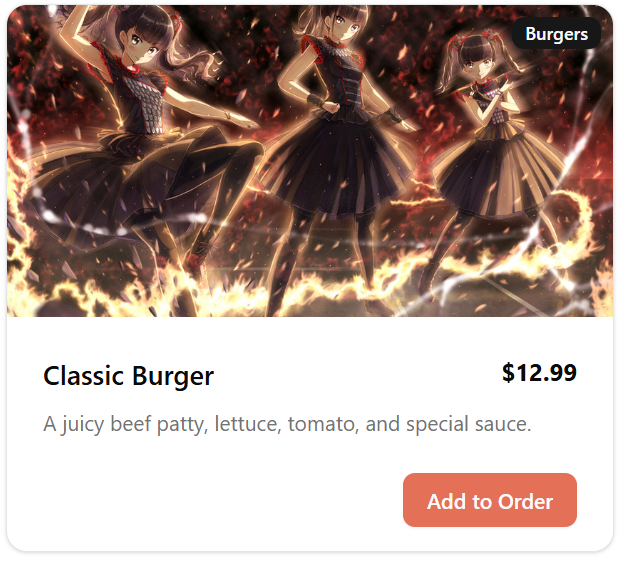
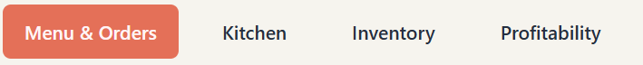
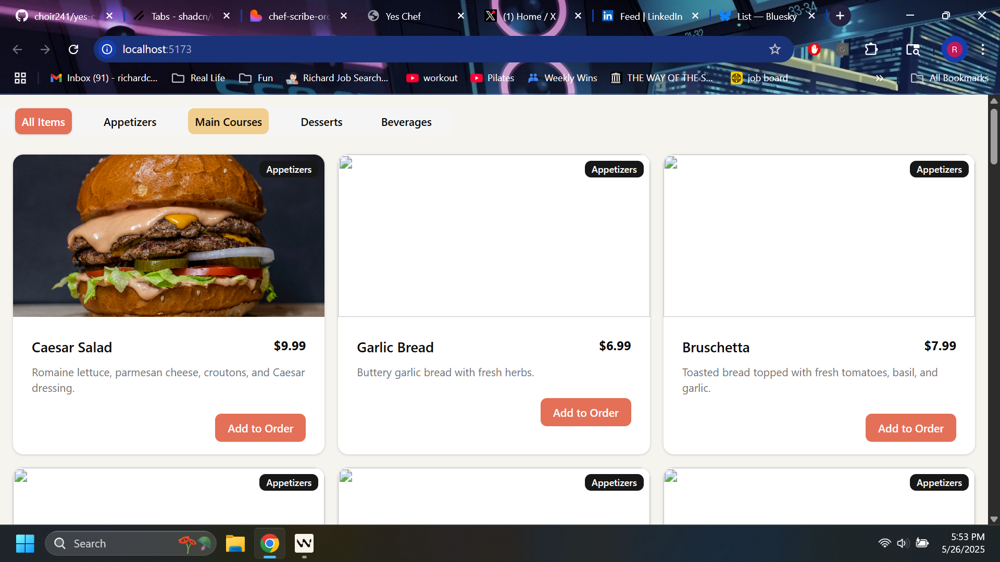
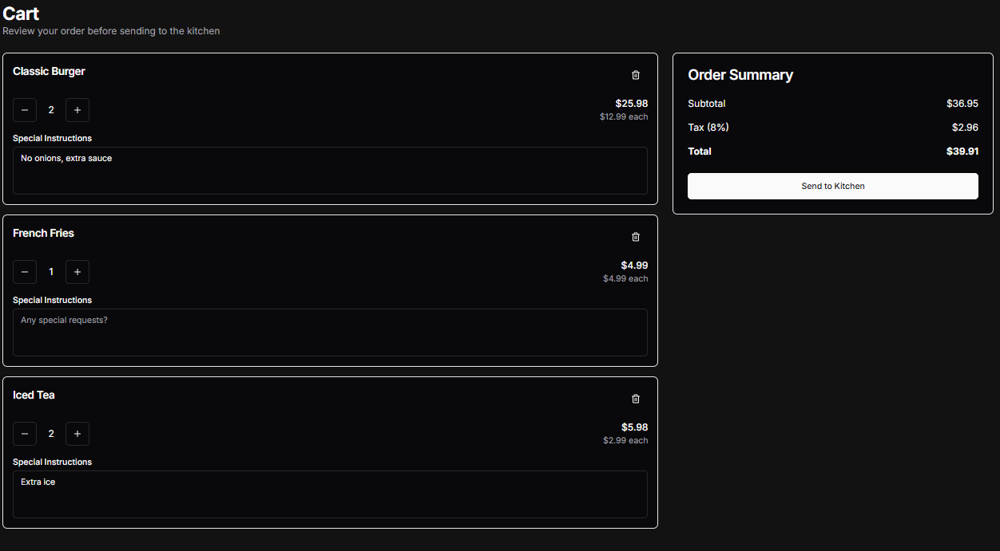
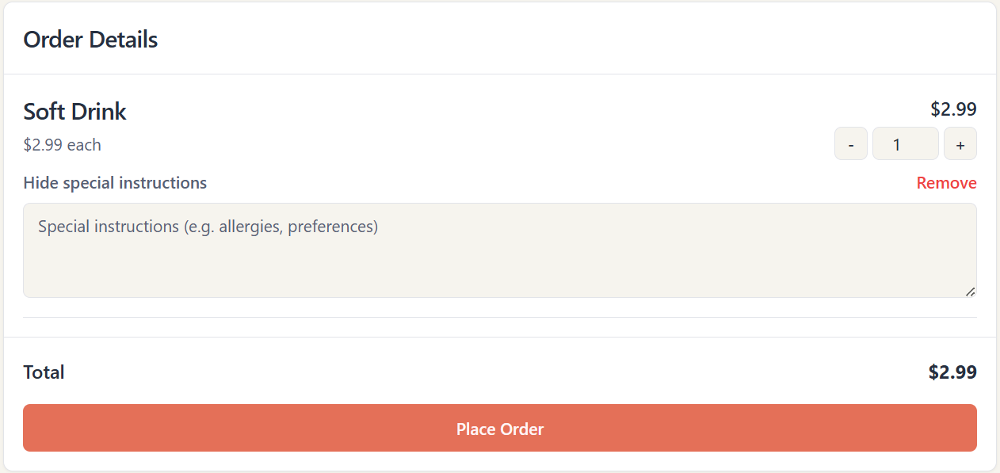
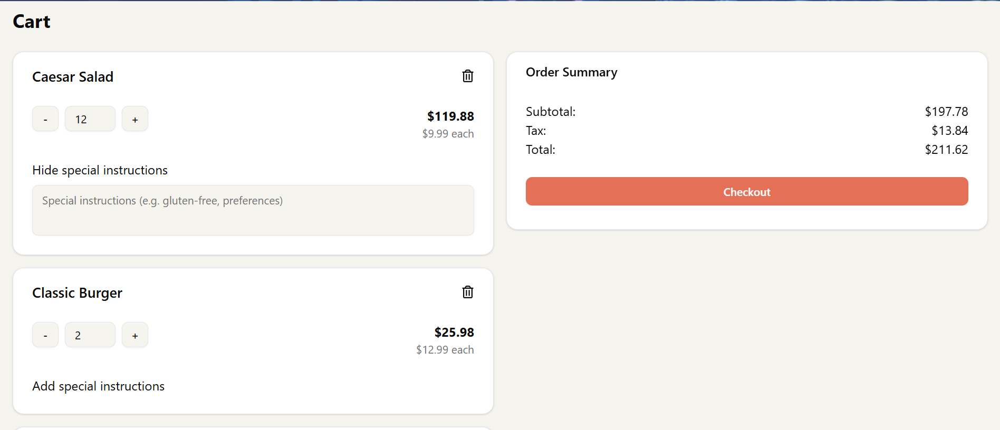
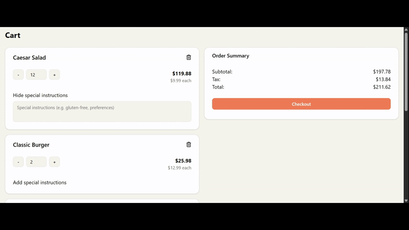

# Yes Chef App - Richard version

Wanting an application that I build on my own while also being in full control of the organization and flow of the folder structure, I decided to take the DSD group project I worked on with the team and take full ownership of it while not changing the original repo.

The purpose of this documentation is to document my thought process and my planning, and make contributing back to this more efficient and more organized.

## Planning

MVP Features:

- Menu with choice of items

  - Selectable menu items by food category
  - Menu item quantity selection
  - When selected, the menu item, its quantity, and its total price should be displayed in the cart

- Cart

  - Menu item(s) quantity should be able to change by the users selection
  - Menu item(s) should be able to be removed
  - Menu item(s) should be able to have custom instructions for ingredients/others
  - When selecting the purchase button, all of the menu items in the cart should be sent to the kitchen

- Kitchen open tickets

  - User should be able to see the amount of items they need to order
    - Removing menu items being separated by category because the information doesn't seem necessary
  - User should be able to cross off a menu item when they complete cooking it
  - User should be able to click on a button that marks unstarted tickets as started
    - When the ticket is marked as started, the ticket UI changes to visually indicate to the user that the ticket has started
    - When ticket is marked as started, the started tickets are reordered as priority from left to right or top to bottom
  - User should be able to click on a button that marks started tickets as completed
    - When the ticket is marked as completed, the ticket is removed from the list of tickets
  - Removed displaying kitchen closed tickets because there doesn't seem there's a good reason to display them to the user specifically. But I can see displaying graphs as a nice to have for financial quarters.

- Kitchen Predictions

  - User should be able to receive menu item recommendation preparation based on the completed orders made throughout the kitchen order history.
    - ie. 2:00 - 3:00 prepare 2 more servings of fries because it's indicated from the order history that fries are ordered more than the average amount of ordered fries
  - Kitchen Predictions should update based on any new orders

- Inventory

  - List of ingredients stock and the quantity of each ingredient
    - User should be able to update the ingredient quantity, and when they update the ingredient quantity, the UI should display the updated ingredient quantity
  - Threshold level
    - When current ingredient quantity reaches or goes below threshold level, the ingredient item gets automatically ordered
    - When the item gets automatically ordered, the ingredient quantity gets automatically updated
  - Unit cost per ingredient
    - Maybe display a market price to compare current price
  - Next date of order
    - When the computer local date reaches the next date of order, the system will automatically make a set quantity of ingredients being ordered
    - When the computer makes the automatic order, the current ingredient quantity gets updated
    - When the computer makes the automatic order, the next date of order changes for a future date depending on the current quantity of ingredients and how frequently the ingredient gets ordered
  - Order additional ingredient items
    - User should be able to select quantity
    - Display order total based on the item quantity
    - When clicking the make order button, the ingredient quantity updates according to the amount ordered

- Profitability
  - Display menu item, ingredients, profits, and expenses
    - Displays each ingredient individual cost
    - Uses price of menu to calculate profit of menu item
    - Using restaurant order history, track the amount of profit this menu item has brought in
  - Waste management of ingredients
    - Maybe it makes more sense to have the waste management for each ingredient item in the Invnetory page
    - Displays each ingredient item, the amount wasted for the item today, the total amount of ingredients wasted in a month, and in a year, and the total amount of money lost in the item being wasted
    - When the ingredient item waste quantity gets updated, the inventory ingredient item should also be updated to reflect the waste

## Design

V0



Lovable


## File Organization

- `client`
  - `app`
    - `components`
      - `menu`
        - `MenuCategory.tsx`
        - `MenuInterfaces.ts`
        - `Item.tsx`
      - `cart`
        - `CartInterfaces.ts`
        - `CartItem.tsx`
        - `OrderSummary.tsx`
      - `ui`
        - `button.tsx`
        - `card.tsx`
        - `badge.tsx`
    - `hooks`
      - `cart`
        - `addToCart.ts`
    - `static`
      - `labels.ts`
      - `menuItems.ts`
    - `pages`
      - `home.tsx`
      - `cart.tsx`
    - `assets`
      - `readme`
    - `routes.ts`
    - `root.tsx`

## Interfaces

### Menu Item Card

Located in `components/menu/MenuInterfaces.ts`

```typescript
export interface IMenuItem {
  name: string;
  category: string;
  price: number;
  description: string;
  image: string;
}
```

### Cart Item

Located in `components/cart/CartInterfaces.ts`

```typescript
export interface ICartItem {
  name: string;
  price: number;
  quantity: number;
  instructions?: string;
}
```

## Components

Menu Item card component

### Design



### Color



### Current



Category component

### Design


### Color



### Current



Cart component

### Design



### Color



### Current





## Hooks

`addToCart.ts`

event handler for adding a menu item to the cart by making a POST request to the backend and creating a new document in the database collection

## Reducers

## Backend Routes

GET /cart

returns a json array of cart items consisting of the name, price, quantity, and instructions of the menu item

POST /addToCart

creates a new document in the cart collection with the name, price, quantity, and instructions of the menu item

## Database Design

- `restaurant`
  - `cart`
    - name
    - price
    - quantity
    - instructions

## Dependencies

- Utilty-First CSS framework: Tailwind CSS
- UI Component Library: Shadcn UI
- Router: React Router
- Database: MongoDB
- Cors: cors
- Data fetching: Tanstack Query
- Environment variables: dotenv

## Tech Stacks

- Frontend: Typescript
- Library: React
- Build tool: Vite
- Backend: Node.js
- Backend Framework: Express
- Backend Language: Typescript